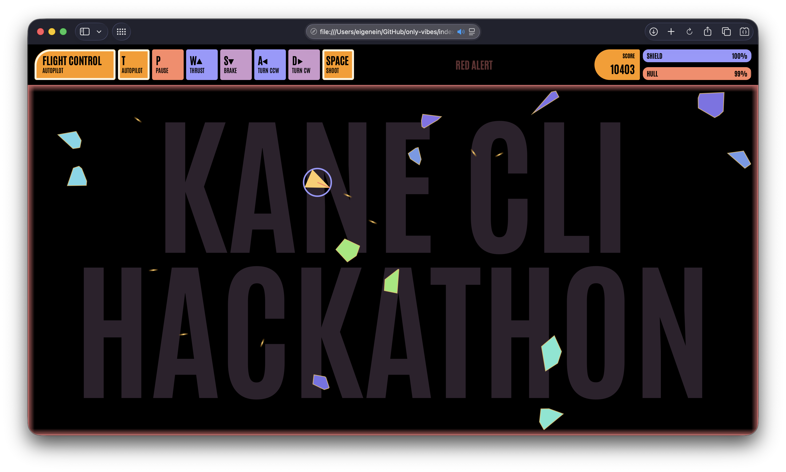

# Only Vibes

A classic single-page Asteroids game in pure HTML and JavaScript, with an LCARS-inspired interface and code that boldly goes wherever the prompt takes it.

This project was made for the [Kane CLI Hackathon](https://luma.com/kanecli-online).

> [!IMPORTANT]
> **The code quality is by no means attributed to me.** It is **146% vibe-coded for purpose**.
> The point of this project
> was the full loop: automated development, browser-based verification, and
> iterating on what the running game actually did. The implementation is the
> artifact of that loop.

> [!CAUTION]
> The game works best in Google Chrome because Kane CLI's browser automation
> and verification workflow is tied to Chrome.

## Play

Play the hosted version on [GitHub Pages](https://eigenein.github.io/only-vibes/). You can also open [`index.html`](index.html) directly in a browser.

### Controls

| Key | Action |
| --- | --- |
| `SPACE` | Shoot |
| `W` / `S` | Thrust / brake |
| `A` / `D` | Turn counter-clockwise / clockwise |
| `P` | Pause / resume |
| `T` | Toggle autopilot |

### Shield and hull

- The ship starts with a full shield and hull.
- The collision damage is proportional to the momentum.
- Collision damage is split proportionally between the shield and hull based
  on the shield remaining at the moment of impact. The shield regenerates
  while the game is running.
- Hull damage does not regenerate during the current life.
- Arena walls also damage the ship.
- When the hull reaches zero, the game briefly shows the failure state before
  starting a fresh life.

Redder asteroids are heavier and hit harder. Fire at will. Keep the hull operational.

## Built with

- HTML5 canvas
- Plain ES2025 JavaScript
- Web fonts loaded from Google Fonts

All gameplay code lives in [`index.js`](index.js); [`index.html`](index.html)
is intentionally minimal. The JavaScript is also a roughly 5,000-line,
gloriously non-refactored monument to shipping the full loop first and
asking architectural questions later.
