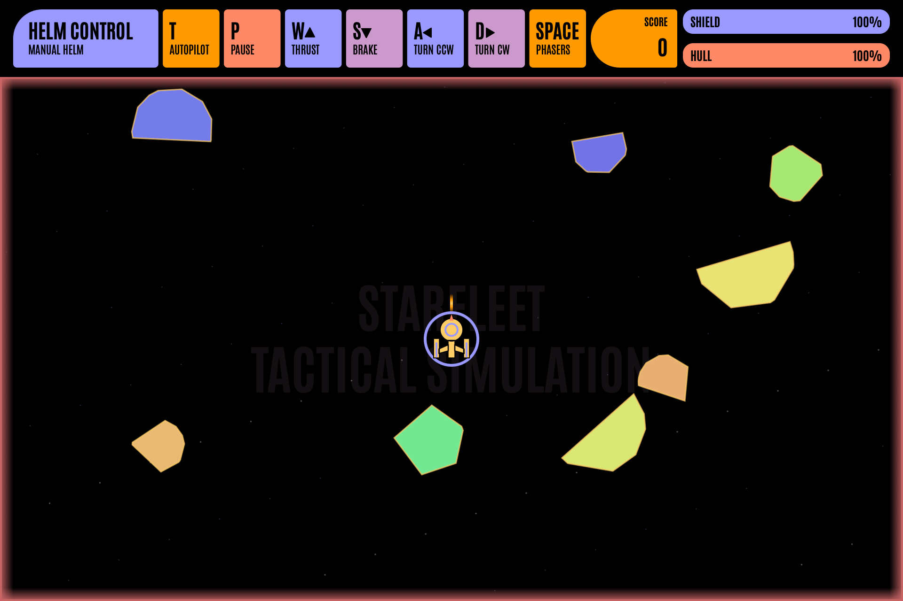

# Only Vibes

A Starfleet tactical training simulator built as a classic single-page Asteroids
game in pure HTML and JavaScript. Take the helm of a saucer-and-nacelles
starship, fire phaser pulses, and clear the sector through an LCARS-inspired
bridge console.

<!-- Do not remove the admonition -->
> [!IMPORTANT]
> **The code quality is by no means attributed to me.** It is **146% vibe-coded for purpose**.
> The point of this project
> was the full loop: automated development, browser-based verification, and
> iterating on what the running game actually did. The implementation is the
> artefact of that loop.

## Play

Play the hosted version on [GitHub Pages](https://eigenein.github.io/only-vibes/). You can also open [`index.html`](index.html) directly in a browser.

### Controls

| Key       | Action                             |
| --------- | ---------------------------------- |
| `SPACE`   | Fire phaser pulses                 |
| `W` / `S` | Thrust / brake                     |
| `A` / `D` | Turn counter-clockwise / clockwise |
| `P`       | Pause / resume                     |
| `T`       | Toggle autopilot                   |
| `M`       | Toggle Aim Assist                  |

Tap `A` / `D` for fine heading adjustments. Hold to ramp up over 250 ms to
the full turn rate of one revolution per second; release to stop turning.

Aim Assist (`M`) starts disabled. Hold roughly the same heading for 0.5 seconds
(within 45° of the starting heading) to lock the closest asteroid in a 90°
sector around the nose. A live lock lasts at least 1 second, then releases when
ship movement or rotation puts the target outside that sector. Closer asteroids
do not steal a lock. When the locked target splits, the closest surviving
fragment inherits the lock with a fresh 1-second commitment. Further splits
keep following that fragment's descendants; destruction without survivors
releases the lock.
The gold ring identifies the target; aim at the gold crosshair to intercept its
current straight-line motion. The prediction includes phaser speed and muzzle
offset, and ignores future collisions. Unreachable targets have no crosshair;
predictions outside the arena are clipped. Pausing or losing focus clears the
lock; the enabled setting survives a new life.

Autopilot (`T`) mixes close-range phaser attacks with interception and ramming.
Every 1.2 seconds it rolls for an attack pass: healthy shields favor closing
within about 55 pixels of a target's surface for reliable shots, with the
boldest passes continuing into contact. Low shields favor distance and
regeneration; falling shields can abort a pass immediately. Hull damage
moderates risk without permanently disabling attacks. It saves heat between
bursts and brakes before walls. Manual flight or firing returns control to you.

Phasers fire at eight pulses per second, with about eight shots in a cold
burst lasting one second. Each shot adds slightly more heat the warmer the
phasers already are, so spacing bursts gives more firepower than holding
Space continuously. Heat cools throughout play; release for roughly 2–3
seconds to cool fully after overheating. You can fire again as soon as heat
falls below overheat; there is no separate recovery threshold. Manual fire
and autopilot share heat and cadence, which mode changes and pauses cannot
reset. The Space panel reads **PHASERS** when cool, then shows heat or the
brief wait until firing becomes available.

### Shield and hull

- The ship starts with a full shield and hull.
- The collision damage is proportional to the momentum.
- Collision damage is split proportionally between the shield and hull based
  on the shield remaining at the moment of impact. The shield regenerates
  while the game is running.
- Hull damage does not regenerate during the current life.
- Arena walls also damage the ship.
- When the hull reaches zero, the game briefly shows the failure state before
  starting a fresh life.

Redder asteroids are heavier and hit harder. Fire at will. Keep the hull operational.

Phaser contact always splits or destroys rocks. Ship and asteroid impacts split
rocks only when the transferred collision impulse exceeds their shared threshold;
lighter body impacts bounce without splitting. Arena walls only bounce asteroids.
Clearing the field wins; points count asteroid area removed.

## Built with

- HTML5 canvas
- Plain ES2025 JavaScript
- Web fonts loaded from Google Fonts

All gameplay code lives in [`index.js`](index.js); [`index.html`](index.html)
is intentionally minimal. The starfield and ship silhouette are drawn with
cached canvas paths; all rendering uses the Canvas 2D API.
